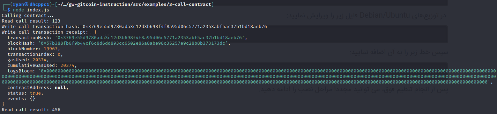

1) Contract call and write Result:

2) Transaction hash: 
```
0x3769e55d9780ada3c12d3b698f4f8a95d06c5771a2353abf5ac37b1bd18aeb76
```
3) Deployed contract address: 
```
0x1a378E2A3E3B9453403C45eB11074bf30f7FDACB
```
4) ABI:
```
[
    {
      "inputs": [],
      "stateMutability": "payable",
      "type": "constructor"
    },
    {
      "inputs": [
        {
          "internalType": "uint256",
          "name": "x",
          "type": "uint256"
        }
      ],
      "name": "set",
      "outputs": [],
      "stateMutability": "payable",
      "type": "function"
    },
    {
      "inputs": [],
      "name": "get",
      "outputs": [
        {
          "internalType": "uint256",
          "name": "",
          "type": "uint256"
        }
      ],
      "stateMutability": "view",
      "type": "function"
    }
  ]
```
